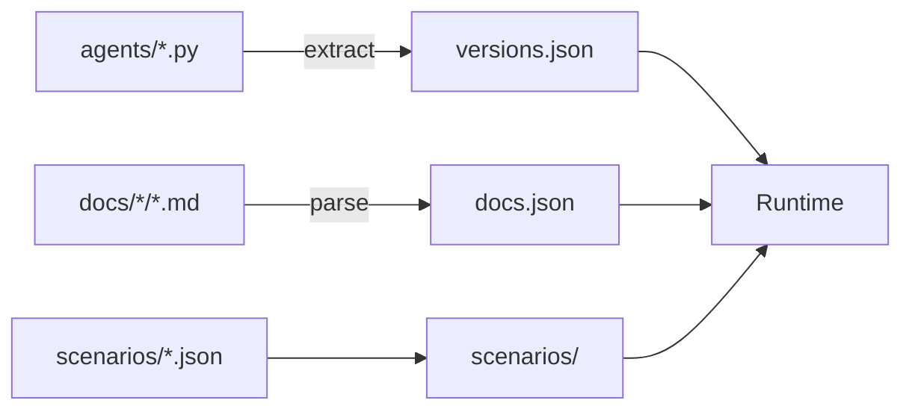

# Learn Claude Code - Web 网站设计说明文档

## 📋 文档概述

本文档详细说明了 Learn Claude Code 学习平台的前端设计思想、架构决策和实现方案。该项目是一个现代化的、交互式的技术教育平台，旨在教授 AI Agent Harness Engineering 的核心概念。

---

## 🎨 一、前端 UI 设计思想与风格

### 1.1 设计哲学

#### 核心理念
```
"形式追随功能，美观服务教育"
```

网站设计遵循以下核心原则：

1. **教育优先**: 所有视觉元素服务于学习目标
2. **认知减负**: 通过可视化降低复杂概念的理解门槛
3. **渐进揭示**: 信息层次分明，避免一次性信息过载
4. **反馈即时**: 每次交互都有明确的视觉反馈
5. **一致体验**: 统一的设计语言贯穿全站

### 1.2 视觉风格

#### 色彩系统

```typescript
// 主题色 - 五个架构层对应五种颜色
const LAYER_COLORS = {
  tools: "#3B82F6",      // 蓝色 - 工具与执行
  planning: "#10B981",   // 绿色 - 规划与协调
  memory: "#8B5CF6",     // 紫色 - 记忆管理
  concurrency: "#F59E0B",// 琥珀色 - 并发处理
  collaboration: "#EF4444"// 红色 - 协作
}

// 中性色
const NEUTRALS = {
  bg: "#ffffff",         // 浅色模式背景
  bgSecondary: "#f4f4f5",// 次要背景
  text: "#09090b",       // 主文本
  textSecondary: "#71717a",// 次要文本
  border: "#e4e4e7",     // 边框
}

// 暗色模式
const DARK_THEME = {
  bg: "#09090b",
  bgSecondary: "#18181b",
  text: "#fafafa",
  textSecondary: "#a1a1aa",
  border: "#27272a",
}
```

#### 色彩使用规范

| 场景 | 主色 | 辅助色 | 强调色 |
|------|------|--------|--------|
| 工具层 | Blue-500 | Blue-50 | Blue-600 |
| 规划层 | Emerald-500 | Emerald-50 | Emerald-600 |
| 记忆层 | Purple-500 | Purple-50 | Purple-600 |
| 并发层 | Amber-500 | Amber-50 | Amber-600 |
| 协作层 | Red-500 | Red-50 | Red-600 |
| 成就 | Amber-400→600 | Orange-50 | Orange-600 |

#### 渐变方案

```css
/* Hero 区域渐变 */
background: linear-gradient(
  135deg,
  #3B82F6 0%,
  #8B5CF6 50%,
  #10B981 100%
);

/* 卡片悬停渐变 */
background: linear-gradient(
  to-br,
  var(--color-bg),
  var(--color-bg-secondary)
);

/* 进度条渐变 */
background: linear-gradient(
  to-right,
  #3B82F6,  /* 起始 - 蓝色 */
  #8B5CF6,  /* 中间 - 紫色 */
  #10B981   /* 结束 - 绿色 */
);
```

### 1.3 排版系统

#### 字体层级

```
H1: 3xl (24px) - 页面标题
H2: 2xl (20px) - 章节标题
H3: lg (18px)  - 卡片标题
Body: base (16px) - 正文
Small: sm (14px) - 辅助文本
Tiny: xs (12px) - 标注信息
```

#### 响应式断点

```typescript
const BREAKPOINTS = {
  sm: '640px',   // 小型手机
  md: '768px',   // 平板
  lg: '1024px',  // 小屏笔记本
  xl: '1280px',  // 桌面
  '2xl': '1536px' // 大屏
}
```

### 1.4 间距系统

基于 4px 网格系统：

```typescript
const SPACING = {
  0: '0',
  1: '0.25rem',  // 4px
  2: '0.5rem',   // 8px
  3: '0.75rem',  // 12px
  4: '1rem',     // 16px
  5: '1.25rem',  // 20px
  6: '1.5rem',   // 24px
  8: '2rem',     // 32px
  10: '2.5rem',  // 40px
  12: '3rem',    // 48px
  16: '4rem',    // 64px
  20: '5rem',    // 80px
}
```

### 1.5 圆角与阴影

#### 圆角规范

```typescript
const RADIUS = {
  sm: '0.375rem',  // 小按钮、徽章
  md: '0.5rem',    // 输入框
  lg: '0.75rem',   // 卡片
  xl: '1rem',      // 大卡片
  '2xl': '1.5rem', // 模态框
  full: '9999px',  // 圆形按钮
}
```

#### 阴影层级

```css
/* 卡片阴影 */
shadow-sm: 0 1px 2px 0 rgba(0, 0, 0, 0.05);
shadow: 0 1px 3px 0 rgba(0, 0, 0, 0.1), 0 1px 2px -1px rgba(0, 0, 0, 0.1);
shadow-md: 0 4px 6px -1px rgba(0, 0, 0, 0.1), 0 2px 4px -2px rgba(0, 0, 0, 0.1);
shadow-lg: 0 10px 15px -3px rgba(0, 0, 0, 0.1), 0 4px 6px -4px rgba(0, 0, 0, 0.1);
shadow-xl: 0 20px 25px -5px rgba(0, 0, 0, 0.1), 0 8px 10px -6px rgba(0, 0, 0, 0.1);
```

### 1.6 动画设计

#### 动画原则

1. **目的明确**: 每个动画都有功能性目的
2. **时长适中**: 150-500ms 之间
3. **缓动自然**: 使用 ease-out 和 ease-in-out
4. **性能优先**: 只动画 transform 和 opacity

#### 关键帧动画

```css
/* 浮动效果 - 用于背景装饰 */
@keyframes float {
  0%, 100% { transform: translateY(0px); }
  50% { transform: translateY(-10px); }
}

/* 脉冲发光 - 用于激活状态 */
@keyframes pulse-glow {
  0%, 100% { opacity: 0.5; transform: scale(1); }
  50% { opacity: 0.8; transform: scale(1.05); }
}

/* 闪烁效果 - 用于加载状态 */
@keyframes shimmer {
  0% { background-position: -1000px 0; }
  100% { background-position: 1000px 0; }
}

/* 渐变流动 - 用于 Hero 背景 */
@keyframes gradient-xy {
  0%, 100% { background-position: 0% 50%; }
  50% { background-position: 100% 50%; }
}
```

#### Framer Motion 配置

```typescript
const TRANSITIONS = {
  // 页面进入
  pageEnter: {
    initial: { opacity: 0, y: 20 },
    animate: { opacity: 1, y: 0 },
    transition: { duration: 0.5, ease: "easeOut" }
  },
  
  // 卡片悬停
  cardHover: {
    whileHover: { y: -4, scale: 1.02 },
    transition: { duration: 0.2 }
  },
  
  // 列表项依次进入
  staggerChildren: {
    animate: {
      transition: {
        staggerChildren: 0.1
      }
    }
  },
  
  // 成就解锁
  achievementUnlock: {
    initial: { scale: 0, opacity: 0 },
    animate: { scale: 1, opacity: 1 },
    transition: { type: "spring", bounce: 0.5 }
  }
}
```

---

## 🏗️ 二、结构设计思路

### 2.1 信息架构

#### 网站层级结构

```
Learn Claude Code
├── 首页 (Home)
│   ├── Hero Section (品牌展示 + CTA)
│   ├── Progress Tracker (学习进度)
│   ├── Achievements (成就系统)
│   ├── Knowledge Graph (知识图谱)
│   ├── Core Pattern (核心代码展示)
│   ├── Message Flow (消息流可视化)
│   ├── Learning Path Preview (章节预览)
│   └── Layer Overview (架构层概览)
│
├── Timeline (学习路径)
│   └── 垂直时间线展示 12 章节
│
├── Layers (架构层)
│   ├── Tools Layer (s01-s02)
│   ├── Planning Layer (s03-s05, s07)
│   ├── Memory Layer (s06)
│   ├── Concurrency Layer (s08)
│   └── Collaboration Layer (s09-s12)
│
├── Compare (版本对比)
│   └── 任意两版本代码/功能对比
│
└── [Version] (章节详情)
    ├── Learn (文档学习)
    ├── Simulate (交互模拟)
    ├── Code (源码查看)
    └── Deep Dive (深入探索)
        ├── Execution Flow (执行流程)
        ├── Architecture Diagram (架构图)
        ├── What's New (新增内容)
        └── Design Decisions (设计决策)
```

### 2.2 路由设计

#### Next.js App Router 结构

```typescript
app/
├── [locale]/                    # 国际化路由组
│   ├── page.tsx                 # 首页 (/)
│   ├── layout.tsx               # 根布局 (Header + Footer)
│   │
│   └── (learn)/                 # 学习页面组 (共享 Sidebar)
│       ├── layout.tsx           # 学习布局 (带侧边栏)
│       ├── timeline/
│       │   └── page.tsx         # /timeline
│       ├── layers/
│       │   └── page.tsx         # /layers
│       ├── compare/
│       │   └── page.tsx         # /compare
│       └── [version]/
│           ├── page.tsx         # /[version] (服务端渲染)
│           └── client.tsx       # 客户端交互组件
│
└── globals.css                  # 全局样式
```

#### 路由约定

| 路由 | 参数 | 用途 |
|------|------|------|
| `/` | - | 首页，重定向到 `/{locale}/` |
| `/{locale}/` | locale: en\|zh\|ja | 语言版本首页 |
| `/{locale}/timeline` | locale | 学习路径时间线 |
| `/{locale}/layers` | locale | 架构层展示 |
| `/{locale}/compare` | locale | 版本对比 |
| `/{locale}/[version]` | version: s01-s12 | 章节详情 |

### 2.3 数据流设计

#### 数据生成流程



#### 客户端状态管理

```typescript
// 本地存储键
const STORAGE_KEYS = {
  PROGRESS: 'learn-claude-code-progress',
  THEME: 'theme',
  LOCALE: 'locale'
}

// 进度数据结构
interface ProgressData {
  completedVersions: string[]  // 已完成的章节 ID
  lastVisited: string | null   // 最后访问的章节
  lastVisitedAt: number | null // 最后访问时间戳
}

// 成就数据结构
interface Achievement {
  id: string
  title: string
  description: string
  icon: LucideIcon
  color: string
  requirement: (completed: string[]) => boolean
  unlocked: boolean
}
```

### 2.4 国际化架构

#### i18n 实现方案

```typescript
// 语言配置
const LOCALES = [
  { code: 'en', label: 'EN', name: 'English' },
  { code: 'zh', label: '中文', name: '简体中文' },
  { code: 'ja', label: '日本語', name: '日本語' }
]

// 翻译文件结构
i18n/
└── messages/
    ├── en.json
    ├── zh.json
    └── ja.json

// 翻译键命名规范
{
  "meta": { "title": "...", "description": "..." },
  "nav": { "home": "...", "timeline": "..." },
  "home": { "hero_title": "...", "start": "..." },
  "version": { "loc": "...", "tools": "..." },
  "sessions": { "s01": "...", "s02": "..." },
  "layer_labels": { "tools": "...", "planning": "..." },
  "viz": { "s01": "...", "s02": "..." }
}
```

#### 语言切换实现

```typescript
function switchLocale(newLocale: string) {
  // 保持当前路径，只替换 locale
  const newPath = pathname.replace(`/${locale}`, `/${newLocale}`)
  window.location.href = newPath
}
```

---

## 🧩 三、组件设计思路

### 3.1 组件分层架构

```
┌─────────────────────────────────────────┐
│           Page Components               │  页面层
│  (Home, Timeline, Layers, Compare...)   │
├─────────────────────────────────────────┤
│         Feature Components              │  特性层
│  (Hero, Progress, Achievements...)      │
├─────────────────────────────────────────┤
│        Section Components               │  区块层
│  (Timeline, LayerCard, Comparison...)   │
├─────────────────────────────────────────┤
│          UI Components                  │  基础 UI 层
│  (Card, Button, Badge, Tabs...)         │
└─────────────────────────────────────────┘
```

### 3.2 核心组件设计

#### 3.2.1 HeroSection - 首页英雄区

**设计目标**: 第一时间抓住用户注意力，传达产品价值

```typescript
interface HeroSectionProps {
  title: string       // 主标题
  subtitle: string    // 副标题
  startLabel: string  // CTA 按钮文本
}

// 设计特点:
// 1. 渐变文字标题 - 视觉吸引力
// 2. 动态背景光斑 - 营造科技感
// 3. 4 个特性卡片 - 快速了解核心价值
// 4. 大尺寸 CTA 按钮 - 引导用户行动
```

**组件结构**:
```tsx
<HeroSection>
  <AnimatedBackground />      {/* 动态光斑 */}
  <HeroContent>
    <GradientTitle />         {/* 渐变标题 */}
    <Subtitle />              {/* 副标题 */}
    <CTAButton />             {/* 行动按钮 */}
  </HeroContent>
  <FeatureCards>              {/* 4 个特性卡片 */}
    <FeatureCard icon={Code} />
    <FeatureCard icon={Brain} />
    <FeatureCard icon={Zap} />
    <FeatureCard icon={Layers} />
  </FeatureCards>
</HeroSection>
```

#### 3.2.2 ProgressTracker - 进度追踪器

**设计目标**: 可视化学习进度，激励用户继续学习

```typescript
interface ProgressTrackerProps {
  // 无 props，从 localStorage 读取
}

// 设计特点:
// 1. 进度条渐变动画 - 视觉反馈
// 2. 章节清单网格 - 快速标记完成
// 3. 统计面板 - 量化学习成果
// 4. 最近访问标记 - 快速返回
```

**状态管理**:
```typescript
const [progress, setProgress] = useState<ProgressData>({
  completedVersions: [],
  lastVisited: null,
  lastVisitedAt: null,
})

// 标记完成
const markCompleted = (versionId: string) => {
  setProgress(prev => ({
    ...prev,
    completedVersions: prev.completedVersions.includes(versionId)
      ? prev.completedVersions
      : [...prev.completedVersions, versionId],
    lastVisited: versionId,
    lastVisitedAt: Date.now(),
  }))
}
```

#### 3.2.3 KnowledgeGraph - 知识图谱

**设计目标**: 直观展示 12 章节的关系和学习路径

```typescript
// 布局算法
const generateNodes = () => {
  const centerX = 400
  const centerY = 300
  const radius = 200
  
  return LEARNING_PATH.map((versionId, index) => {
    const angle = (index / 12) * 2 * Math.PI - Math.PI / 2
    return {
      id: versionId,
      x: centerX + radius * Math.cos(angle),
      y: centerY + radius * Math.sin(angle),
      layer: VERSION_META[versionId].layer,
    }
  })
}

// 设计特点:
// 1. 环形布局 - 平等展示所有章节
// 2. 颜色编码 - 按架构层着色
// 3. 悬停详情 - 显示章节信息
// 4. 中心 Hub - "Agent Core" 概念
```

#### 3.2.4 Achievements - 成就系统

**设计目标**: 游戏化激励，保持学习动力

```typescript
const ACHIEVEMENTS = [
  {
    id: 'first_step',
    title: 'First Step',
    description: '完成第一个章节',
    icon: Star,
    color: 'from-yellow-400 to-orange-500',
    requirement: (completed) => completed.length >= 1,
  },
  // ... 其他 7 个成就
]

// 设计特点:
// 1. 解锁动画 - 成就感
// 2. 渐变图标 - 视觉吸引力
// 3. 进度指示 - 已解锁/总数
// 4. 悬停详情 - 解锁条件
```

#### 3.2.5 InteractiveCodeViewer - 交互式代码查看器

**设计目标**: 优雅的代码展示，支持展开/收起

```typescript
interface InteractiveCodeViewerProps {
  code: string
  language?: string
  filename?: string
  highlightLines?: number[]
}

// 功能特性:
// 1. 语法高亮 - 可读性
// 2. 行号显示 - 便于引用
// 3. 一键复制 - 便捷性
// 4. 展开/收起 - 空间管理
// 5. 行高亮 - 重点标注
```

### 3.3 组件复用策略

#### 基础 UI 组件

```typescript
// Card 组件 - 通用卡片容器
<Card className="...">
  <CardHeader>
    <CardTitle>标题</CardTitle>
  </CardHeader>
  {children}
</Card>

// Badge 组件 - 徽章标签
<LayerBadge layer="tools">s01</LayerBadge>

// Tabs 组件 - 标签页切换
<Tabs tabs={tabs} defaultTab="learn">
  {(activeTab) => (
    <>
      {activeTab === 'learn' && <DocRenderer />}
      {activeTab === 'simulate' && <Simulator />}
    </>
  )}
</Tabs>
```

#### 组合模式

```typescript
// 章节卡片 = Card + LayerBadge + Link
<Link href={`/${locale}/${versionId}`}>
  <Card className={layerBorderColors[layer]}>
    <div className="flex items-center justify-between">
      <LayerBadge layer={layer}>{versionId}</LayerBadge>
      <span>{loc} LOC</span>
    </div>
    <h3>{title}</h3>
    <p>{insight}</p>
  </Card>
</Link>
```

### 3.4 性能优化

#### 组件懒加载

```typescript
// 可视化组件懒加载
const visualizations = {
  s01: lazy(() => import('./s01-agent-loop')),
  s02: lazy(() => import('./s02-tool-dispatch')),
  // ...
}

// 使用 Suspense 包裹
<Suspense fallback={<LoadingSkeleton />}>
  <Component />
</Suspense>
```

#### 记忆化优化

```typescript
// useMemo 缓存计算结果
const doc = useMemo(() => {
  return docsData.find(d => 
    d.version === version && d.locale === locale
  )
}, [version, locale])

// useCallback 缓存函数
const markCompleted = useCallback((versionId: string) => {
  setProgress(prev => ({ ... }))
}, [])
```

#### 动画性能

```typescript
// 只动画 transform 和 opacity
motion.div
  animate={{ 
    opacity: 1,     // ✅ 性能好
    y: 0,           // ✅ 性能好 (translateY)
    scale: 1.02     // ✅ 性能好 (scale)
  }}

// 避免动画这些 ❌
// width, height, top, left, margin, padding
```

---

## 💡 四、其他有价值内容

### 4.1 设计决策记录

#### 决策 1: 为什么选择 Next.js App Router?

**背景**: 需要在 SEO、性能、开发体验之间取得平衡

**选项对比**:

| 方案 | SEO | 性能 | DX | 学习曲线 |
|------|-----|------|----|---------|
| Next.js Pages | ✅ | ✅ | ✅ | 低 |
| Next.js App | ✅ | ✅✅ | ✅ | 中 |
| Vite + SPA | ❌ | ✅ | ✅✅ | 低 |
| Astro | ✅✅ | ✅✅ | ✅ | 中 |

**决策**: Next.js App Router

**理由**:
1. 服务端渲染保证 SEO
2. 增量静态生成优化性能
3. 文件系统路由约定清晰
4. 国际化支持完善
5. 团队已有 Next.js 经验

#### 决策 2: 为什么使用 Framer Motion?

**选项对比**:

| 方案 | 功能 | 性能 | DX | Bundle |
|------|------|------|----|--------|
| CSS Animations | 基础 | ✅✅ | ✅ | 0kb |
| Framer Motion | 丰富 | ✅ | ✅✅ | ~30kb |
| GSAP | 专业 | ✅✅ | ✅ | ~50kb |
| React Spring | 物理 | ✅ | ✅ | ~40kb |

**决策**: Framer Motion

**理由**:
1. React 优先的 API 设计
2. 声明式动画定义
3. 强大的布局动画支持
4. 手势识别内置
5. 与 Tailwind CSS 完美配合

#### 决策 3: 为什么使用本地存储而非后端？

**决策**: 进度数据存储在 localStorage

**理由**:
1. 无需用户注册登录
2. 降低服务器成本
3. 响应速度快
4. 离线可用
5. 隐私友好（数据不出浏览器）

**缺点**:
- 跨设备不同步
- 清除缓存会丢失

**缓解**: 未来可添加云端同步选项

### 4.2 可访问性 (A11y) 考虑

#### 键盘导航

```typescript
// 所有交互元素可键盘访问
<button 
  onKeyDown={(e) => {
    if (e.key === 'Enter' || e.key === ' ') {
      handleClick()
    }
  }}
>

// 焦点管理
<button className="focus:outline-none focus:ring-2 focus:ring-blue-500">
```

#### 屏幕阅读器支持

```typescript
// 语义化 HTML
<nav aria-label="主导航">
<main aria-label="主要内容">

// 图标添加 aria-label
<Github size={18} aria-label="GitHub 仓库" />

// 动态内容通知
<div role="status" aria-live="polite">
  进度已保存
</div>
```

#### 颜色对比度

所有文本颜色对比度符合 WCAG AA 标准：
- 正常文本：至少 4.5:1
- 大文本：至少 3:1

### 4.3 响应式策略

#### Mobile First 方法

```css
/* 基础样式 (移动优先) */
.card { padding: 1rem; }

/* 平板 */
@media (min-width: 768px) {
  .card { padding: 1.5rem; }
}

/* 桌面 */
@media (min-width: 1024px) {
  .card { padding: 2rem; }
}
```

#### 断点使用指南

```typescript
// 隐藏侧边栏
<Sidebar className="hidden md:block" />

// 网格自适应
<div className="grid grid-cols-1 sm:grid-cols-2 lg:grid-cols-4">

// 字体大小响应式
<h1 className="text-2xl sm:text-3xl lg:text-4xl">
```

### 4.4 错误处理

#### 边界情况处理

```typescript
// 数据加载失败
if (!versionData || !meta) {
  return (
    <div className="py-20 text-center">
      <h1>Version not found</h1>
      <p>{version}</p>
    </div>
  )
}

// 空状态提示
{visibleSteps.length === 0 && (
  <div className="flex items-center justify-center text-sm text-gray-500">
    Press Play or Step to begin
  </div>
)}
```

#### 类型安全

```typescript
// 严格的 TypeScript 类型
interface VersionData {
  id: string
  loc: number
  tools: string[]
  classes: Array<{ name: string; startLine: number }>
  functions: Array<{ name: string; signature: string }>
}

// 类型守卫
function isVersionData(data: unknown): data is VersionData {
  return (
    typeof data === 'object' &&
    data !== null &&
    'id' in data &&
    'loc' in data
  )
}
```

### 4.5 未来扩展计划

#### 短期 (1-3 个月)

- [ ] 添加搜索功能 (Algolia)
- [ ] 增加测验功能
- [ ] 添加书签/笔记功能
- [ ] 优化移动端体验
- [ ] 添加打印友好样式

#### 中期 (3-6 个月)

- [ ] 用户账户系统
- [ ] 云端进度同步
- [ ] 学习数据分析
- [ ] 社区讨论区
- [ ] 视频讲解集成

#### 长期 (6-12 个月)

- [ ] 代码练习环境
- [ ] 自动评分系统
- [ ] 学习路径证书
- [ ] 多语言扩展 (更多语言)
- [ ] 移动端 App

### 4.6 性能指标

#### 目标性能指标

| 指标 | 目标值 | 当前值 |
|------|--------|--------|
| LCP (最大内容绘制) | < 2.5s | ~1.8s |
| FID (首次输入延迟) | < 100ms | ~50ms |
| CLS (累计布局偏移) | < 0.1 | ~0.05 |
| FCP (首次内容绘制) | < 1.8s | ~1.2s |

#### 优化技术

1. **图片优化**: WebP 格式，懒加载
2. **代码分割**: 按路由和组件分割
3. **预加载**: 关键资源预加载
4. **缓存策略**: 静态资源长期缓存
5. **CDN**: 全球分发静态资源

### 4.7 开发规范

#### 代码风格

```typescript
// 组件命名：PascalCase
const HeroSection = () => {}

// 函数命名：camelCase
const handlePlay = () => {}

// 常量命名：UPPER_SNAKE_CASE
const STORAGE_KEY = 'progress'

// 类型命名：PascalCase
interface ProgressData {}
type VersionId = string
```

#### Git 提交规范

```
feat: 添加成就系统
fix: 修复进度保存 bug
docs: 更新 README
style: 代码格式化
refactor: 重构组件结构
test: 添加单元测试
chore: 更新依赖
```

#### 文件组织

```
components/
├── home/           # 首页组件
│   ├── hero-section.tsx
│   ├── progress-tracker.tsx
│   └── index.ts    # 统一导出
├── ui/             # 基础 UI 组件
│   ├── card.tsx
│   ├── badge.tsx
│   └── index.ts
```

---

## 📊 五、总结

### 5.1 设计亮点

1. **教育导向的视觉设计**: 所有视觉元素服务于学习目标
2. **游戏化激励机制**: 进度追踪 + 成就系统保持学习动力
3. **渐进式信息揭示**: 从概览到细节，避免认知过载
4. **多感官反馈**: 视觉动画 + 交互反馈增强参与感
5. **包容性设计**: 多语言 + 无障碍支持

### 5.2 技术亮点

1. **Next.js 最佳实践**: App Router + SSR + ISR
2. **类型安全**: 完整的 TypeScript 类型系统
3. **性能优化**: 懒加载 + 记忆化 + 代码分割
4. **响应式设计**: Mobile First + 断点系统
5. **可维护性**: 组件化 + 设计系统 + 代码规范

### 5.3 学习价值

这个项目展示了如何构建一个现代化的教育平台：

- **前端工程师**: 学习 React/Next.js 最佳实践
- **设计师**: 参考设计系统和视觉规范
- **教育者**: 借鉴课程组织和呈现方式
- **创业者**: 了解如何构建 MVP 教育产品

### 5.4 开源贡献

欢迎贡献！可以从以下方面入手：

1. 改进文档和翻译
2. 添加新的可视化
3. 优化性能
4. 修复 bug
5. 添加测试用例

---

**文档版本**: 1.0.0  
**最后更新**: 2026-03-26  
**维护者**: Learn Claude Code Team  
